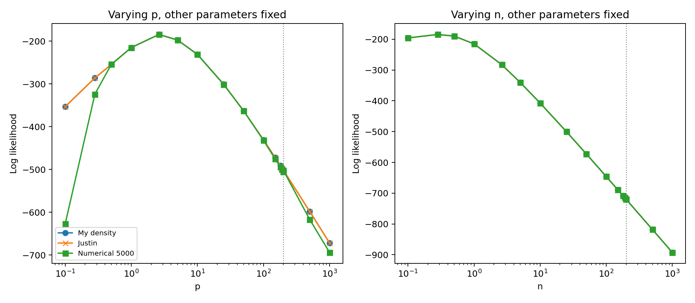

```{raw:typst}
#set page(margin: auto)
```

# BEGE Density

This audit compares three fixed-shape BEGE density implementations on the ARX(1,1) residuals from the canonical effective sample.

The ARX(1,1) residual is computed as

$$
u_t = \pi_t - \left(c + \rho_1 \pi_{t-1} + \phi_1 SPF_t\right),
$$

using the OLS coefficients re-estimated on the 1969Q2--2022Q4 sample:

$$
\hat\pi_t = 0.082431 + 0.300540\pi_{t-1} + 0.733720SPF_t.
$$

The Gaussian OLS log likelihood is `-207.381`, AIC is `420.762`, and BIC is `430.874`.

## ARX(1,1) Residual Summary

| Statistic | Value |
| --- | --- |
| Date start | 1969Q2 |
| Date end | 2022Q4 |
| Observations | 215 |
| Mean | 0.000000 |
| Std | 0.636326 |
| Min | -4.131190 |
| P5 | -0.945215 |
| Median | -0.015764 |
| P95 | 1.006587 |
| Max | 2.078000 |
| Skewness | -1.047441 |
| Excess kurtosis | 8.210174 |

## Shape Parameter Range From Previous BEGE Runs

The range below uses eligible ARX(1,1) rows from BadGood, InflationDeflation, and Full BEGE results. For each saved parameter vector I recomputed the recursive shape paths on the common ARX(1,1) residuals, then summarized all observations and all eligible rows. The density comparison itself keeps the selected shape values constant across time.

| Model | Rows | p q05 | p median | p q95 | p max | n q05 | n median | n q95 | n max | sigma_p med | sigma_n med |
| --- | ---: | ---: | ---: | ---: | ---: | ---: | ---: | ---: | ---: | ---: | ---: |
| BadGood | 994 | 1.4285 | 2.8130 | 6.4330 | 9753.4145 | 0.0714 | 0.3320 | 2.8342 | 375.9309 | 0.2355 | 0.5555 |
| InflationDeflation | 2 | 0.3740 | 88.3267 | 4873.1670 | 19278.3164 | 1.7530 | 6.6728 | 9.6269 | 106.4844 | 0.0101 | 0.4377 |
| Full | 1001 | 1.7137 | 2.9317 | 6.0974 | 249.5837 | 0.0853 | 0.3128 | 3.2982 | 226.2040 | 0.2192 | 0.5654 |

## Representative Fixed-Shape Parameter Sets

| Set | p | n | sigma_p | sigma_n | Source |
| --- | ---: | ---: | ---: | ---: | --- |
| provided_reference | 2.627875 | 0.281123 | 0.285666 | 0.800204 | User supplied fixed-shape parameter vector |
| pooled_median_estimates | 2.931671 | 0.331970 | 0.219222 | 0.555532 | Pooled median over eligible ARX(1,1) BG/ID/Full shape paths |
| BadGood_best_AIC_median_shape | 8.268020 | 165.155773 | 0.313328 | 0.057609 | BadGood eligible ARX(1,1) best AIC row, median recursive shape fixed over time |
| InflationDeflation_best_AIC_median_shape | 207.898317 | 1.762666 | 0.009492 | 0.564762 | InflationDeflation eligible ARX(1,1) best AIC row, median recursive shape fixed over time |
| Full_best_AIC_median_shape | 10.971806 | 6.274336 | 0.078104 | 0.255866 | Full eligible ARX(1,1) best AIC row, median recursive shape fixed over time |
| Full_moderate_shape | 1.951557 | 0.350555 | 0.279768 | 0.499828 | Best Full ARX(1,1) eligible row with max recursive shape <= 20 |

## Analytic Density Speed And Accuracy

`BEGE_density.py` is the current implementation. `BEGE_density_Justin.py` is Justin's analytic formula, with only import/broadcasting fixes so it can be evaluated on a residual vector. Justin's formula is a good cross-check at ordinary shape values, but the direct hypergeometric expression can become numerically unreliable in the high-shape/tiny-scale region.

| Set | My LL | Justin LL | My - Justin | My sec | Justin sec | Speedup | My bad obs | Justin bad obs |
| --- | ---: | ---: | ---: | ---: | ---: | ---: | ---: | ---: |
| provided_reference | -184.567903 | -184.567903 | 0.000000 | 0.0013 | 0.0019 | 1.51 | 0 | 0 |
| pooled_median_estimates | -191.032391 | -191.032391 | 0.000000 | 0.0016 | 0.0020 | 1.29 | 0 | 0 |
| BadGood_best_AIC_median_shape | -261.605747 | -261.605747 | -0.000000 | 0.3461 | 0.2705 | 0.78 | 0 | 0 |
| InflationDeflation_best_AIC_median_shape | -261.874077 | -2004.605695 | 1742.731618 | 0.0029 | 0.4959 | 168.55 | 0 | 0 |
| Full_best_AIC_median_shape | -205.355396 | -205.355396 | -0.000000 | 0.0143 | 0.0169 | 1.18 | 0 | 0 |
| Full_moderate_shape | -191.816801 | -191.816801 | 0.000000 | 0.0016 | 0.0021 | 1.35 | 0 | 0 |

## Numerical Integration At 50,000 Grid Points

The numerical integration function is `BEGE_density_Numerical_Integration.py::loglikedgam_constant`. It is much slower and uses a finite-difference CDF approximation with internal density clipping, so it should be read as a convergence diagnostic rather than the optimizer backend.

| Set | npoints | Numerical LL | Numerical - Justin | Numerical - My | Seconds | Bad obs |
| --- | ---: | ---: | ---: | ---: | ---: | ---: |
| provided_reference | 50000 | -184.570672 | -0.002769 | -0.002769 | 11.9904 | 0 |
| pooled_median_estimates | 50000 | -191.030273 | 0.002118 | 0.002118 | 11.3891 | 0 |
| BadGood_best_AIC_median_shape | 50000 | -261.608349 | -0.002602 | -0.002602 | 8.1962 | 0 |
| InflationDeflation_best_AIC_median_shape | 50000 | -283.725143 | 1720.880553 | -21.851066 | 7.8211 | 0 |
| Full_best_AIC_median_shape | 50000 | -205.354646 | 0.000750 | 0.000750 | 7.6112 | 0 |
| Full_moderate_shape | 50000 | -191.810118 | 0.006683 | 0.006683 | 11.3621 | 0 |

## Numerical Grid Comparison

| Set | npoints | Numerical LL | Numerical - Justin | Numerical - My | Seconds | Bad obs |
| --- | ---: | ---: | ---: | ---: | ---: | ---: |
| provided_reference | 250 | -194.539176 | -9.971272 | -9.971272 | 0.0581 | 0 |
| provided_reference | 500 | -184.511448 | 0.056456 | 0.056456 | 0.1141 | 0 |
| provided_reference | 1000 | -184.578742 | -0.010839 | -0.010839 | 0.2308 | 0 |
| provided_reference | 2500 | -184.565409 | 0.002494 | 0.002494 | 0.6065 | 0 |
| provided_reference | 5000 | -184.588624 | -0.020721 | -0.020721 | 1.1713 | 0 |
| provided_reference | 10000 | -184.626067 | -0.058164 | -0.058164 | 2.3394 | 0 |
| provided_reference | 25000 | -184.562840 | 0.005063 | 0.005063 | 5.9827 | 0 |
| provided_reference | 50000 | -184.570672 | -0.002769 | -0.002769 | 11.9904 | 0 |
| pooled_median_estimates | 250 | -193.293857 | -2.261466 | -2.261466 | 0.0549 | 0 |
| pooled_median_estimates | 500 | -190.142384 | 0.890007 | 0.890007 | 0.1085 | 0 |
| pooled_median_estimates | 1000 | -190.656484 | 0.375908 | 0.375908 | 0.2164 | 0 |
| pooled_median_estimates | 2500 | -191.058886 | -0.026495 | -0.026495 | 0.5455 | 0 |
| pooled_median_estimates | 5000 | -190.954713 | 0.077678 | 0.077678 | 1.1102 | 0 |
| pooled_median_estimates | 10000 | -191.018795 | 0.013597 | 0.013597 | 2.2152 | 0 |
| pooled_median_estimates | 25000 | -191.030905 | 0.001486 | 0.001486 | 5.6627 | 0 |
| pooled_median_estimates | 50000 | -191.030273 | 0.002118 | 0.002118 | 11.3891 | 0 |
| BadGood_best_AIC_median_shape | 250 | -262.088568 | -0.482821 | -0.482821 | 0.0397 | 0 |
| BadGood_best_AIC_median_shape | 500 | -261.834404 | -0.228657 | -0.228657 | 0.0768 | 0 |
| BadGood_best_AIC_median_shape | 1000 | -261.717033 | -0.111286 | -0.111286 | 0.1537 | 0 |
| BadGood_best_AIC_median_shape | 2500 | -261.649744 | -0.043998 | -0.043998 | 0.3869 | 0 |
| BadGood_best_AIC_median_shape | 5000 | -261.627839 | -0.022092 | -0.022092 | 0.7834 | 0 |
| BadGood_best_AIC_median_shape | 10000 | -261.616985 | -0.011238 | -0.011238 | 1.5701 | 0 |
| BadGood_best_AIC_median_shape | 25000 | -261.610504 | -0.004757 | -0.004757 | 4.0558 | 0 |
| BadGood_best_AIC_median_shape | 50000 | -261.608349 | -0.002602 | -0.002602 | 8.1962 | 0 |
| InflationDeflation_best_AIC_median_shape | 250 | -266.225235 | 1738.380460 | -4.351158 | 0.0374 | 0 |
| InflationDeflation_best_AIC_median_shape | 500 | -265.925689 | 1738.680007 | -4.051612 | 0.0725 | 0 |
| InflationDeflation_best_AIC_median_shape | 1000 | -265.851793 | 1738.753903 | -3.977716 | 0.1458 | 0 |
| InflationDeflation_best_AIC_median_shape | 2500 | -265.738716 | 1738.866979 | -3.864639 | 0.3707 | 0 |
| InflationDeflation_best_AIC_median_shape | 5000 | -266.417142 | 1738.188554 | -4.543065 | 0.7566 | 0 |
| InflationDeflation_best_AIC_median_shape | 10000 | -264.862210 | 1739.743486 | -2.988133 | 1.5028 | 0 |
| InflationDeflation_best_AIC_median_shape | 25000 | -283.726618 | 1720.879078 | -21.852541 | 3.9068 | 0 |
| InflationDeflation_best_AIC_median_shape | 50000 | -283.725143 | 1720.880553 | -21.851066 | 7.8211 | 0 |
| Full_best_AIC_median_shape | 250 | -205.228564 | 0.126832 | 0.126832 | 0.0360 | 0 |
| Full_best_AIC_median_shape | 500 | -205.288935 | 0.066462 | 0.066462 | 0.0698 | 0 |
| Full_best_AIC_median_shape | 1000 | -205.321379 | 0.034017 | 0.034017 | 0.1385 | 0 |
| Full_best_AIC_median_shape | 2500 | -205.341573 | 0.013823 | 0.013823 | 0.3468 | 0 |
| Full_best_AIC_median_shape | 5000 | -205.348426 | 0.006970 | 0.006970 | 0.7067 | 0 |
| Full_best_AIC_median_shape | 10000 | -205.351876 | 0.003521 | 0.003521 | 1.4575 | 0 |
| Full_best_AIC_median_shape | 25000 | -205.353952 | 0.001444 | 0.001444 | 3.8195 | 0 |
| Full_best_AIC_median_shape | 50000 | -205.354646 | 0.000750 | 0.000750 | 7.6112 | 0 |
| Full_moderate_shape | 250 | -191.622072 | 0.194729 | 0.194729 | 0.0547 | 0 |
| Full_moderate_shape | 500 | -191.304747 | 0.512054 | 0.512054 | 0.1069 | 0 |
| Full_moderate_shape | 1000 | -191.595790 | 0.221010 | 0.221010 | 0.2132 | 0 |
| Full_moderate_shape | 2500 | -191.757932 | 0.058868 | 0.058868 | 0.5339 | 0 |
| Full_moderate_shape | 5000 | -191.833422 | -0.016621 | -0.016621 | 1.1171 | 0 |
| Full_moderate_shape | 10000 | -191.840997 | -0.024197 | -0.024197 | 2.2207 | 0 |
| Full_moderate_shape | 25000 | -191.807490 | 0.009311 | 0.009311 | 5.6844 | 0 |
| Full_moderate_shape | 50000 | -191.810118 | 0.006683 | 0.006683 | 11.3621 | 0 |


## Shape Tail Consistency

Holding all other parameters at the supplied reference values, I varied only one shape parameter at a time. With `sigma_p` and `sigma_n` fixed, the BEGE variance grows with the shape level (`p sigma_p^2 + n sigma_n^2`), so the log likelihood is not expected to converge to a finite constant as a shape goes to infinity. The practical diagnostic is that it should not jump to artificial huge positive values. The current implementation now switches to the saddlepoint backend at shape values of 180 or larger.

| Varied | Value | My LL | Justin LL | Numerical LL | My - Justin | Numerical - Justin |
| --- | ---: | ---: | ---: | ---: | ---: | ---: |
| p | 0.100000 | -353.196160 | -353.196160 | -627.012654 | 0.000000 | -273.816494 |
| p | 0.281123 | -286.187041 | -286.187041 | -324.159811 | 0.000000 | -37.972769 |
| p | 0.500000 | -254.627702 | -254.627702 | -254.124790 | 0.000000 | 0.502912 |
| p | 1.000000 | -215.192962 | -215.192962 | -215.163538 | 0.000000 | 0.029424 |
| p | 2.627875 | -184.567903 | -184.567903 | -184.588624 | 0.000000 | -0.020721 |
| p | 5.000000 | -197.590645 | -197.590645 | -197.504194 | 0.000000 | 0.086451 |
| p | 10.000000 | -231.075710 | -231.075710 | -230.994323 | 0.000000 | 0.081387 |
| p | 25.000000 | -300.879828 | -300.879828 | -301.255475 | -0.000000 | -0.375647 |
| p | 50.000000 | -362.950150 | -362.950150 | -362.638729 | -0.000000 | 0.311422 |
| p | 100.000000 | -430.630875 | -430.630875 | -431.903915 | -0.000000 | -1.273040 |
| p | 150.000000 | -471.841657 | -471.841657 | -475.098379 | 0.000000 | -3.256722 |
| p | 180.000000 | -490.677375 | -490.633397 | -494.414661 | -0.043978 | -3.781264 |
| p | 190.000000 | -496.266913 | -496.231555 | -499.997488 | -0.035358 | -3.765932 |
| p | 199.000000 | -501.060804 | -501.031991 | -505.249126 | -0.028814 | -4.217135 |
| p | 200.000000 | -501.580516 | -501.552368 | -502.052734 | -0.028148 | -0.500366 |
| p | 500.000000 | -597.793830 | -597.809215 | -616.616072 | 0.015385 | -18.806857 |
| p | 1000.000000 | -671.542070 | -671.554703 | -693.730190 | 0.012633 | -22.175486 |
| n | 0.100000 | -195.826372 | -195.826372 | -195.906953 | 0.000000 | -0.080582 |
| n | 0.281123 | -184.567903 | -184.567903 | -184.588624 | 0.000000 | -0.020721 |
| n | 0.500000 | -189.723337 | -189.723337 | -189.714298 | -0.000000 | 0.009038 |
| n | 1.000000 | -215.189118 | -215.189118 | -215.141665 | 0.000000 | 0.047453 |
| n | 2.627875 | -282.639840 | -282.639840 | -282.603954 | 0.000000 | 0.035885 |
| n | 5.000000 | -340.467259 | -340.467259 | -340.444277 | 0.000000 | 0.022981 |
| n | 10.000000 | -407.358977 | -407.358977 | -407.346295 | 0.000000 | 0.012682 |
| n | 25.000000 | -500.178747 | -500.178747 | -500.173367 | 0.000000 | 0.005381 |
| n | 50.000000 | -572.528636 | -572.528636 | -572.525929 | -0.000000 | 0.002707 |
| n | 100.000000 | -645.897580 | -645.897580 | -645.896267 | -0.000000 | 0.001313 |
| n | 150.000000 | -689.093454 | -689.093454 | -689.092616 | -0.000000 | 0.000838 |
| n | 180.000000 | -708.465480 | -708.561302 | -708.560623 | 0.095822 | 0.000679 |
| n | 190.000000 | -714.247804 | -714.338766 | -714.338129 | 0.090962 | 0.000637 |
| n | 199.000000 | -719.198627 | -719.285617 | -719.285014 | 0.086991 | 0.000603 |
| n | 200.000000 | -719.734903 | -719.821474 | -719.820874 | 0.086571 | 0.000599 |
| n | 500.000000 | -817.927907 | -817.963256 | -817.963090 | 0.035348 | 0.000166 |
| n | 1000.000000 | -892.337962 | -892.355757 | -892.355737 | 0.017795 | 0.000020 |



## Findings

- The current `BEGE_density.py` and Justin analytic density agree to numerical precision for ordinary shape values. In the high-shape/tiny-scale stress case, Justin's direct hypergeometric expression is numerically unstable, while the current saddlepoint backend stays finite and much closer to the numerical integration diagnostic.
- The previous import/broadcast issues in `BEGE_density_Justin.py` are fixed, so Justin's analytic function now evaluates scalar fixed-shape parameters over the full residual vector.
- The numerical integration function is useful as a convergence diagnostic, but it is slow and can remain materially away from the analytic density even at large grid sizes for asymmetric or high-shape parameter sets.
- The large-shape diagnostics do not show the current density creating insane positive likelihoods. Lowering the saddlepoint handoff to 180 catches the near-cap region where direct hypergeometric evaluation can produce artificial likelihood improvements.

Generated audit files:

- `BEGE_density_shape_ranges.csv`
- `BEGE_density_representative_sets.csv`
- `BEGE_density_comparison.csv`
- `BEGE_density_numerical_grid.csv`
- `BEGE_density_consistency.csv`
