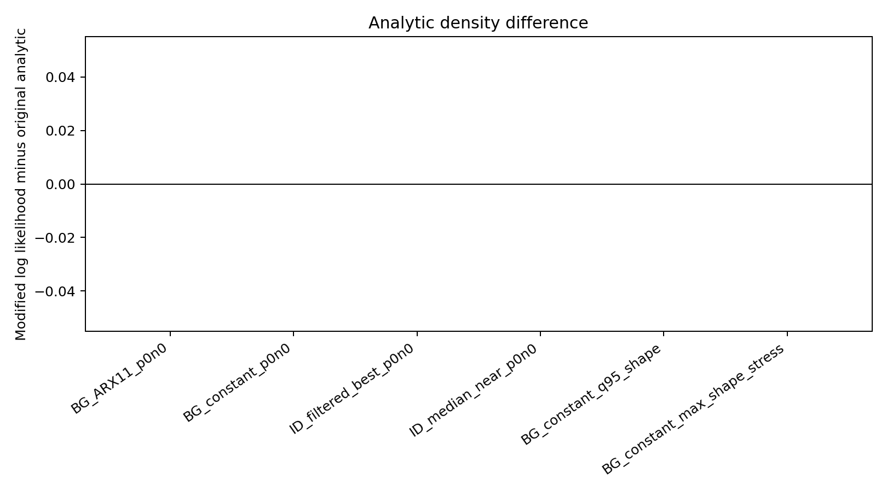
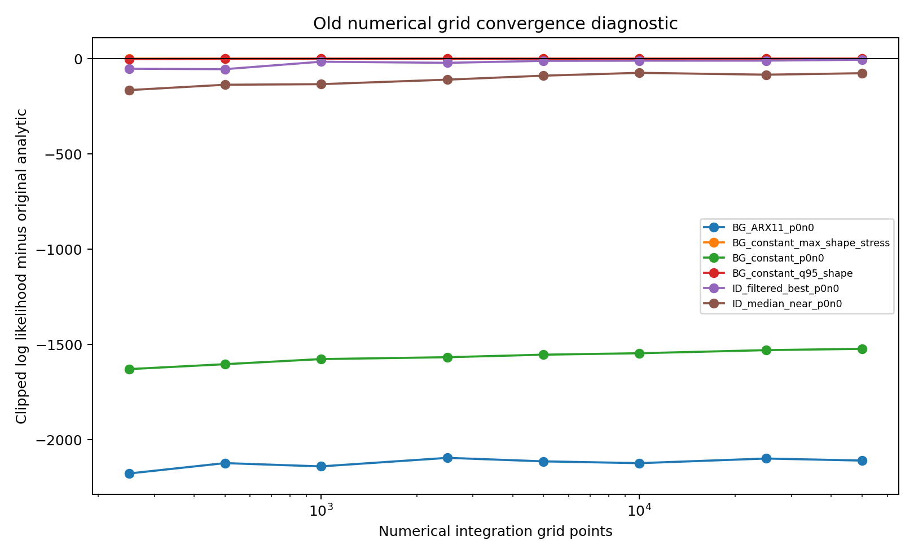

```{raw:typst}
#set page(margin: auto)
```

# BEGE Density Calculation Audit

This check compares three BEGE density calculations on the effective quarterly sample using `SPF_shock` as the observation series:

1. `modified_scipy_approx`: the current fast BEGE density in `BEGE_density.py`.
2. `original_intended_scipy_mpmath`: the analytic BEGE density reconstructed from the pre-speed-pass version of `BEGE_density.py`. I supplied the missing `sys` import so the original intended SciPy fallback can run.
3. `numerical_grid`: the old grid integration method from `numerical_approximation`, evaluated with different numbers of grid points. Raw zero densities are reported as `-inf`; a clipped version is shown only as a convergence diagnostic.

Sample: `1969Q2` to `2022Q4`, observations: `215`.
`SPF_shock` summary: mean `0.159759`, std `0.664175`, min `-4.011699`, max `2.172944`.

## Parameter Sets

| Set | p | n | sigma_p | sigma_n | Source |
| --- | ---: | ---: | ---: | ---: | --- |
| BG_ARX11_p0n0 | 0.249201 | 0.400845 | 0.358047 | 0.452003 | BadGood_BEGE draw_356 ARX(1,1), estimated p0/n0 |
| BG_constant_p0n0 | 1.866047 | 0.059323 | 0.175272 | 1.256051 | BadGood_BEGE draw_356 constant, estimated p0/n0 |
| ID_filtered_best_p0n0 | 0.562484 | 0.240307 | 0.632182 | 1.476408 | InflationDeflation_BEGE seed 50 ARX(2,1), best AIC after excluding near-zero sigmas |
| ID_median_near_p0n0 | 2.001930 | 0.101780 | 0.306041 | 0.458856 | InflationDeflation_BEGE seed 52 ARX(1,1), closest to median p0/n0/sigma vector |
| BG_constant_q95_shape | 21.296899 | 0.623501 | 0.175272 | 1.256051 | BadGood_BEGE draw_356 constant, marginal 95th percentile fitted shape levels |
| BG_constant_max_shape_stress | 94.980366 | 3.471229 | 0.175272 | 1.256051 | BadGood_BEGE draw_356 constant, max fitted shape levels as stress case |

## Analytic Density Comparison

| Set | Original LL | Modified LL | Modified - Original | Max Obs Diff | Original sec | Modified sec | Bad Obs |
| --- | ---: | ---: | ---: | ---: | ---: | ---: | ---: |
| BG_ARX11_p0n0 | -302.421195 | -302.421195 | 0.000000 | 0.000000 | 0.0079 | 0.0008 | 0 |
| BG_constant_p0n0 | -299.251550 | -299.251550 | 0.000000 | 0.000000 | 0.0084 | 0.0014 | 0 |
| ID_filtered_best_p0n0 | -216.814039 | -216.814039 | 0.000000 | 0.000000 | 0.0081 | 0.0010 | 0 |
| ID_median_near_p0n0 | -231.212303 | -231.212303 | 0.000000 | 0.000000 | 0.0111 | 0.0011 | 0 |
| BG_constant_q95_shape | -250.156445 | -250.156445 | 0.000000 | 0.000000 | 0.0081 | 0.0012 | 0 |
| BG_constant_max_shape_stress | -421.533106 | -421.533106 | 0.000000 | 0.000000 | 0.2042 | 0.2023 | 0 |



## Numerical Integration at 50,000 Grid Points

| Set | Grid Points | Raw Numerical LL | Bad Obs | Zero Density Obs | Clipped LL | Clipped - Original | Seconds |
| --- | ---: | ---: | ---: | ---: | ---: | ---: | ---: |
| BG_ARX11_p0n0 | 50000 | -inf | 3 | 3 | -2410.995410 | -2108.574215 | 0.5198 |
| BG_constant_p0n0 | 50000 | -inf | 2 | 2 | -1821.587735 | -1522.336185 | 0.4820 |
| ID_filtered_best_p0n0 | 50000 | -222.770529 | 0 | 0 | -222.770529 | -5.956490 | 0.4544 |
| ID_median_near_p0n0 | 50000 | -307.803252 | 0 | 0 | -307.803252 | -76.590950 | 0.4298 |
| BG_constant_q95_shape | 50000 | -250.174393 | 0 | 0 | -250.174393 | -0.017948 | 0.4597 |
| BG_constant_max_shape_stress | 50000 | -421.533106 | 0 | 0 | -421.533106 | -0.000000 | 0.4795 |

## Numerical Grid Convergence

Entries use the clipped numerical-grid log likelihood minus the original analytic log likelihood. This keeps the convergence diagnostic finite when the raw grid assigns zero density to some observations.

| Set | 250 | 500 | 1000 | 2500 | 5000 | 10000 | 25000 | 50000 |
| --- | ---: | ---: | ---: | ---: | ---: | ---: | ---: | ---: |
| BG_ARX11_p0n0 | -2176.222481 | -2121.889265 | -2139.113074 | -2094.294849 | -2112.681204 | -2122.152786 | -2097.807518 | -2108.574215 |
| BG_constant_max_shape_stress | -0.000002 | -0.000000 | -0.000000 | -0.000000 | -0.000000 | -0.000000 | -0.000000 | -0.000000 |
| BG_constant_p0n0 | -1628.799263 | -1603.003057 | -1576.209835 | -1566.357892 | -1553.041283 | -1545.531499 | -1529.298582 | -1522.336185 |
| BG_constant_q95_shape | -2.058842 | -0.885633 | -0.138251 | -0.468856 | -0.363632 | -0.431610 | -0.077568 | -0.017948 |
| ID_filtered_best_p0n0 | -53.144328 | -55.320483 | -16.258356 | -22.130366 | -11.697453 | -10.944201 | -10.601271 | -5.956490 |
| ID_median_near_p0n0 | -165.061602 | -137.057376 | -134.038846 | -110.249046 | -89.409631 | -74.599469 | -84.333338 | -76.590950 |



## Interpretation

- After the high-shape fallback fix, the modified analytic density and the original intended analytic density match for all parameter sets in this audit, including the high-shape stress case.
- The current default `scipy_approx` path is still fast for moderate shapes, but it now uses the high-precision fallback instead of the asymptotic shortcut when shape/hypergeometric inputs are large. The aggressive shortcut is reserved for `scipy_fast`.
- The numerical grid method is not a reliable benchmark at low grid counts. It can assign zero density to some observations for small-shape cases, and even 50,000 points can remain materially off for asymmetric-scale cases.
- The original analytic function is the right benchmark for validation; the numerical integral is best treated as a convergence diagnostic.

Generated files:

- `BEGE_density_comparison.csv`: analytic comparison rows.
- `BEGE_density_numerical_grid.csv`: numerical-grid rows for all point counts.
- `BEGE_Density_numerical_convergence.png` and `BEGE_Density_analytic_difference.png`: figures used above.
