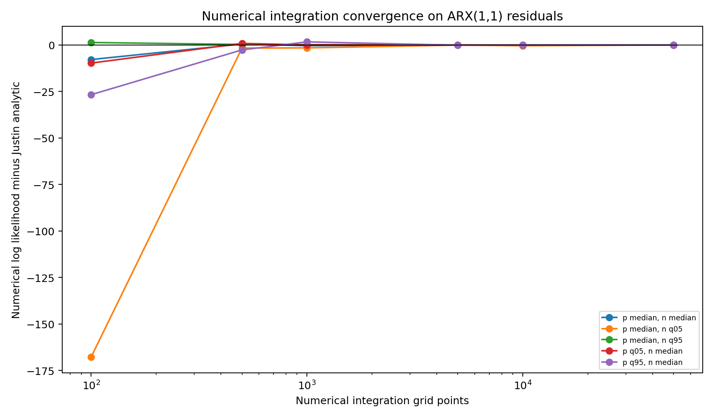
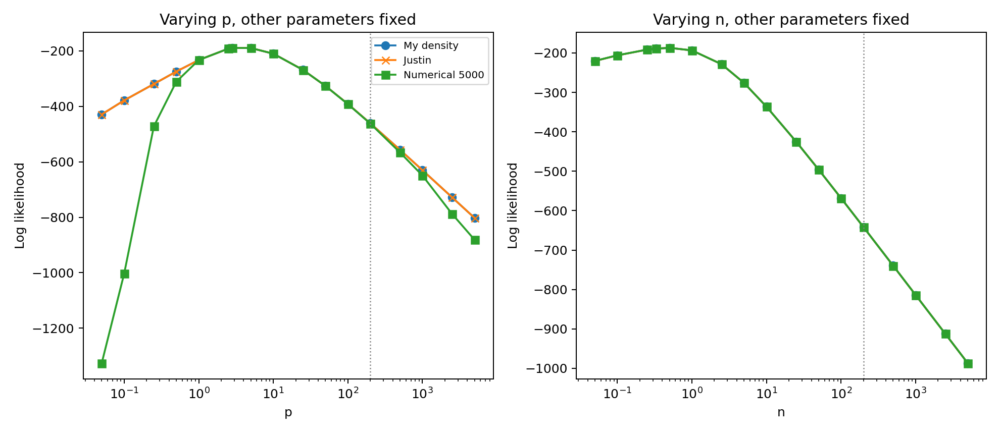

```{raw:typst}
#set page(margin: auto)
```


#  BEGE Density

BEGE density function $f ( u | p, n, \sigma_p, \sigma_n)$ is the function that calculates the density of the observation $u$ given the parameters $\{p, n, \sigma_p, \sigma_n\}$. We have three code on table--Numerical Integration, Justin's code, and my improved code. I compare three code by computing the sum of log likelihood function on real residuals instead of sythetic data. This gives relative comparision between codes. 

I compare three fixed-shape BEGE density implementations on the ARX(1,1) residuals from the canonical effective sample. As a benchmark, the Gaussian OLS log-likelihood is −207.381. The residuals are mean-zero (0.00) with a standard deviation of 0.636326, a negative skewness of −1.047441 and a large excess kurtosis of 8.210174.

## Shape Parameter Range

The range below uses eligible ARX(1,1) rows from the BadGood BEGE results only. For each saved parameter vector I recomputed the recursive shape paths on the common ARX(1,1) residuals, then summarized all observations and all eligible rows. The density comparison itself keeps the selected shape values constant across time.

| Model | Rows | p q05 | p median | p q95 | n q05 | n median | n q95 | sigma_p med | sigma_n med |
| --- | ---: | ---: | ---: | ---: | ---: | ---: | ---: | ---: | ---: |
| BadGood | 994 | 1.4285 | 2.8130 | 6.4330 | 0.0714 | 0.3320 | 2.8342 | 0.2355 | 0.5555 |

## Fixed-Shape Parameter Sets

The log likelihood and timing comparison uses the following five BadGood-based parameter sets. In each row, `sigma_p` and `sigma_n` are held at their BadGood medians.

| Set | p | n | sigma_p | sigma_n |
| --- | ---: | ---: | ---: | ---: |
| p q05, n median | 1.428538 | 0.331970 | 0.235491 | 0.555532 |
| p median, n median | 2.813004 | 0.331970 | 0.235491 | 0.555532 |
| p q95, n median | 6.433015 | 0.331970 | 0.235491 | 0.555532 |
| p median, n q05 | 2.813004 | 0.071355 | 0.235491 | 0.555532 |
| p median, n q95 | 2.813004 | 2.834194 | 0.235491 | 0.555532 |

## Log Likelihood Comparison

`BEGE_density.py` is the current implementation. `BEGE_density_Justin.py` is Justin's analytic formula, and the numerical columns use `BEGE_density_Numerical_Integration.py::loglikedgam_constant` at the stated grid size.

| Parameter set | My function | Justin function | Numerical 100 | Numerical 500 | Numerical 1000 | Numerical 5000 | Numerical 10000 | Numerical 50000 |
| --- | ---: | ---: | ---: | ---: | ---: | ---: | ---: | ---: |
| p q05, n median | -214.162839 | -214.162839 | -223.900355 | -213.330306 | -214.116656 | -214.148282 | -214.146613 | -214.160080 |
| p median, n median | -188.957117 | -188.957117 | -196.801762 | -188.438308 | -189.359597 | -189.033173 | -188.947127 | -188.954400 |
| p q95, n median | -194.340481 | -194.340481 | -221.076698 | -196.996227 | -192.679189 | -194.464527 | -194.368904 | -194.347495 |
| p median, n q05 | -212.877473 | -212.877473 | -380.654962 | -214.556763 | -214.448495 | -212.976377 | -213.323667 | -212.904257 |
| p median, n q95 | -235.887717 | -235.887717 | -234.563988 | -235.609633 | -235.748009 | -235.859932 | -235.873999 | -235.885265 |

- The old numerical integration method converges toward Justin's  likelihood function as the number of grid points increases, but the convergence is slow and requires very fine grids.
- For small or moderate grid sizes, the numerical integration *overestimates* the log-likelihood.   


## Evaluation Speed Comparison

| Parameter set | My function | Justin function | Numerical 100 | Numerical 500 | Numerical 1000 | Numerical 5000 | Numerical 10000 | Numerical 50000 |
| --- | ---: | ---: | ---: | ---: | ---: | ---: | ---: | ---: |
| p q05, n median | 0.0003 | 0.0005 | 0.0086 | 0.0427 | 0.0883 | 0.4326 | 0.9102 | 4.5478 |
| p median, n median | 0.0004 | 0.0006 | 0.0075 | 0.0358 | 0.0730 | 0.3674 | 0.7613 | 3.8117 |
| p q95, n median | 0.0003 | 0.0005 | 0.0064 | 0.0308 | 0.0663 | 0.3258 | 0.6520 | 3.2415 |
| p median, n q05 | 0.0003 | 0.0005 | 0.0076 | 0.0358 | 0.0737 | 0.3567 | 0.7479 | 3.6527 |
| p median, n q95 | 0.0004 | 0.0006 | 0.0059 | 0.0284 | 0.0611 | 0.2900 | 0.5937 | 2.9724 |

- My improved code provides an equavalent accurate and more computationally efficient evaluation.




## Shape Tail Consistency

Holding the other parameters at the BadGood medians (`p=2.8130`, `n=0.3320`, `sigma_p=0.2355`, `sigma_n=0.5555`), I vary either `p` or `n` up to 5000 and compare the three density functions. The numerical integration line uses 5,000 grid points.



## Findings

- BadGood quantiles provide the fixed-shape examples used in the likelihood and timing tables.
- The numerical integration function is useful as a convergence diagnostic, but it is much slower than the analytic functions and remains grid-sensitive.
- The shape-tail plot varies one shape parameter at a time while holding the other shape and both scale parameters at the BadGood medians.
 
