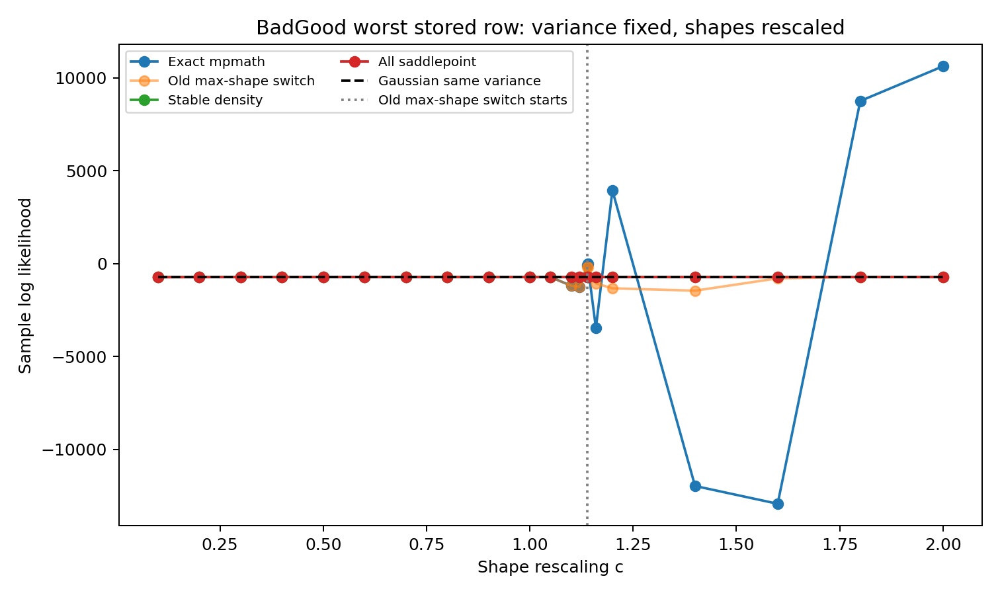
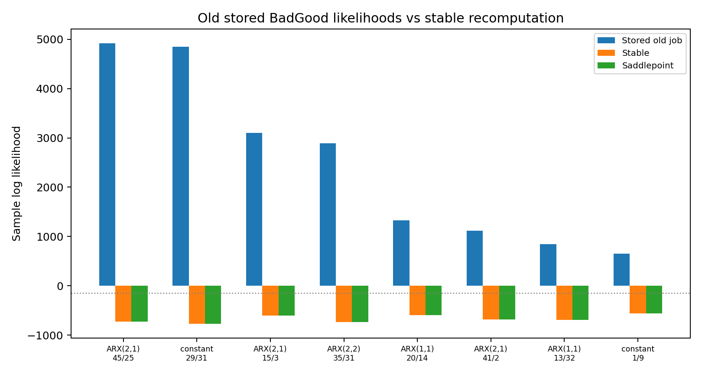
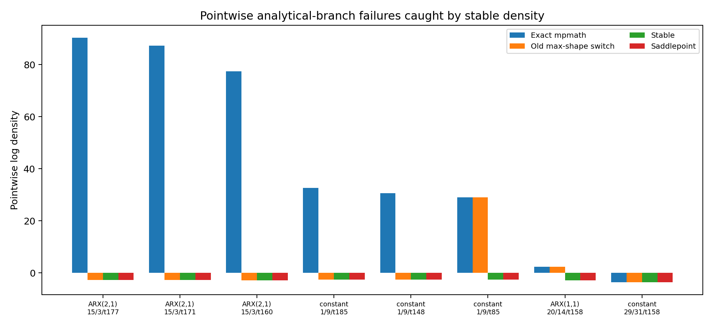

```{raw:typst}
#set page(margin: auto)
```


#  BEGE Density

The BEGE density $f(u| p,n,\sigma_p,\sigma_n)$ is the conditional density
of one inflation residual given the two gamma shape parameters and two scale
parameters. This section compares three implementations:

- numerical integration, which is slow but useful as an independent benchmark;
- Justin's closed-form hypergeometric implementation;
- my stabilized modification on Justin's implementation.

The main conclusion is that Justin's closed-form formula is correct in stable
regions, but its direct numerical evaluation can fail when the shape parameters
enter the transition range where the BEGE distribution is already close to a
Gaussian law. In those cases, very large terms in the hypergeometric expression
nearly cancel. Finite-precision evaluation can then create artificial
pointwise log densities that are numerically impossible and can dominate the
likelihood search.

## Executive Summary

- For moderate shape values, the current implementation and Justin's analytic
  implementation agree to numerical precision.
- On the fixed-shape timing tests below, the current implementation is about
  1.5 times faster than Justin's implementation and about 957 times faster
  than 5,000-grid numerical integration at the median across the five test
  cases.
- The old job-side density produced implausibly large likelihoods on some
  dynamic BEGE estimates. For example, one BadGood ARX(2,1) row had stored
  LogLik 4920.7089, while the stabilized density gives -722.4342 and the
  saddlepoint check gives -722.7255.
- At the pointwise level, one old high-likelihood row reported
  $\ell_t=90.3648$ for an observation with conditional variance 42.9373. The
  stabilized, saddlepoint, and Fourier-inversion values are all about -2.8008.
  This identifies a numerical failure of the hypergeometric evaluation, not an
  economic feature of the BEGE recursion.

## What Changed In `BEGE_density.py`

| Issue | Justin implementation | Current implementation | Reason |
|---|---|---|---|
| Hypergeometric evaluation | Direct `scipy.special.hyperu` or scalar `mpmath.hyperu` fallback. | Vectorized SciPy where stable, selective high-precision fallback, and log-domain asymptotic fallbacks when hyperu is nonfinite. | Avoid paying high-precision cost for every observation while keeping stable exact values. |
| Large-shape transition region | Uses the closed-form branch until a hard max-shape switch. | Guards exact values once $p_t+n_t\geq 40$, blends exact and saddlepoint between total shape 50 and 80, and replaces exact values when exact and saddlepoint differ by more than 2 log units. | The failure is driven by cancellation in total shape, and it can occur before a max-shape cutoff is reached. |
| Near-normal limit | No explicit analytic normal-limit rule. | Uses a Gaussian density when total shape is at least 500 and standardized skewness and excess kurtosis are both below 0.03. | Gamma shocks converge analytically to a normal law under variance-preserving shape rescaling. |
| Density continuity | Hard branch switches can create likelihood discontinuities. | Uses log-sum-exp blending in the transition band. | Keeps the objective smoother for optimization. |
| Failure diagnostics | High likelihoods can silently enter estimation results. | The collector recomputes stored estimates with the stabilized density and writes path/layer diagnostics to CSV. | Prevents stale or unstable density values from determining best models. |

The current thresholds are deliberately conservative: exact hypergeometric
values are still used when they agree with saddlepoint values, while suspicious
large-shape exact values are replaced by the saddlepoint approximation.

I compare three fixed-shape BEGE density implementations on the ARX(1,1) residuals from the canonical effective sample. As a benchmark, the Gaussian OLS log-likelihood is −207.381. The residuals are mean-zero (0.00) with a standard deviation of 0.636326, a negative skewness of −1.047441 and a large excess kurtosis of 8.210174.

## Shape Parameter Range

The range below uses eligible ARX(1,1) rows from the BadGood BEGE results only. For each saved parameter vector I recomputed the recursive shape paths on the common ARX(1,1) residuals, then summarized all observations and all eligible rows. The density comparison itself keeps the selected shape values constant across time.

| Model | Rows | p q05 | p median | p q95 | n q05 | n median | n q95 | sigma_p med | sigma_n med |
| --- | ---: | ---: | ---: | ---: | ---: | ---: | ---: | ---: | ---: |
| BadGood | 994 | 1.4285 | 2.8130 | 6.4330 | 0.0714 | 0.3320 | 2.8342 | 0.2355 | 0.5555 |

## Fixed-Shape Parameter Sets

The log likelihood and timing comparison uses the following five BadGood-based parameter sets. In each row, `sigma_p` and `sigma_n` are held at their BadGood medians.

| Set | p | n | sigma_p | sigma_n |
| --- | ---: | ---: | ---: | ---: |
| p q05, n median | 1.428538 | 0.331970 | 0.235491 | 0.555532 |
| p median, n median | 2.813004 | 0.331970 | 0.235491 | 0.555532 |
| p q95, n median | 6.433015 | 0.331970 | 0.235491 | 0.555532 |
| p median, n q05 | 2.813004 | 0.071355 | 0.235491 | 0.555532 |
| p median, n q95 | 2.813004 | 2.834194 | 0.235491 | 0.555532 |

## Log Likelihood Comparison

`BEGE_density.py` is the current implementation. `BEGE_density_Justin.py` is Justin's analytic formula, and the numerical columns use `BEGE_density_Numerical_Integration.py::loglikedgam_constant` at the stated grid size.

| Parameter set | Current implementation | Justin function | Numerical 100 | Numerical 500 | Numerical 1000 | Numerical 5000 | Numerical 10000 | Numerical 50000 |
| --- | ---: | ---: | ---: | ---: | ---: | ---: | ---: | ---: |
| p q05, n median | -214.162839 | -214.162839 | -223.900355 | -213.330306 | -214.116656 | -214.148282 | -214.146613 | -214.160080 |
| p median, n median | -188.957117 | -188.957117 | -196.801762 | -188.438308 | -189.359597 | -189.033173 | -188.947127 | -188.954400 |
| p q95, n median | -194.340481 | -194.340481 | -221.076698 | -196.996227 | -192.679189 | -194.464527 | -194.368904 | -194.347495 |
| p median, n q05 | -212.877473 | -212.877473 | -380.654962 | -214.556763 | -214.448495 | -212.976377 | -213.323667 | -212.904257 |
| p median, n q95 | -235.887717 | -235.887717 | -234.563988 | -235.609633 | -235.748009 | -235.859932 | -235.873999 | -235.885265 |

- The old numerical integration method converges toward Justin's likelihood function as the number of grid points increases, but the convergence is slow and requires very fine grids.
- For small or moderate grid sizes, the numerical integration *overestimates* the log-likelihood.   


## Evaluation Speed Comparison

| Parameter set | Current implementation | Justin function | Numerical 100 | Numerical 500 | Numerical 1000 | Numerical 5000 | Numerical 10000 | Numerical 50000 |
| --- | ---: | ---: | ---: | ---: | ---: | ---: | ---: | ---: |
| p q05, n median | 0.0003 | 0.0005 | 0.0086 | 0.0427 | 0.0883 | 0.4326 | 0.9102 | 4.5478 |
| p median, n median | 0.0004 | 0.0006 | 0.0075 | 0.0358 | 0.0730 | 0.3674 | 0.7613 | 3.8117 |
| p q95, n median | 0.0003 | 0.0005 | 0.0064 | 0.0308 | 0.0663 | 0.3258 | 0.6520 | 3.2415 |
| p median, n q05 | 0.0003 | 0.0005 | 0.0076 | 0.0358 | 0.0737 | 0.3567 | 0.7479 | 3.6527 |
| p median, n q95 | 0.0004 | 0.0006 | 0.0059 | 0.0284 | 0.0611 | 0.2900 | 0.5937 | 2.9724 |

- The current stabilized analytic implementation is slightly faster than
  Justin's direct analytic implementation in these moderate-shape cases
  (median speedup about 1.5 times).
- The current implementation is orders of magnitude faster than numerical
  integration. Relative to the 5,000-grid integration line, the median speedup
  is about 957 times across the five parameter sets.


## Shape Tail Consistency

Holding the other parameters at the BadGood medians (`p=2.8130`, `n=0.3320`, `sigma_p=0.2355`, `sigma_n=0.5555`), I vary either `p` or `n` up to 5000 and compare the three density functions. The numerical integration line uses 5,000 grid points.


## Robust Large-Shape Evaluation

The closed-form BEGE density contains a confluent hypergeometric term. It is
accurate for small and moderate shape states, but it can become numerically
fragile when the recursive shapes are large because several log terms nearly
cancel. In that region, a low-precision evaluation can create artificial
pointwise log densities that are orders of magnitude too high or too low.

For estimation and result collection, `BEGE_density.py` now uses a guarded
large-shape rule:

- keep the exact hypergeometric expression for small-shape observations;
- use the cumulant saddlepoint density when total shape enters the fragile
  range, with a smooth transition rather than a single discontinuous cutoff;
- replace exact values by the saddlepoint value whenever the two disagree by
  more than the numerical tolerance in the guarded region;
- use the Gaussian density when total shape is large and standardized skewness
  and excess kurtosis are both numerically close to zero.

The saddlepoint approximation is based on the conditional cumulant-generating
function of

$$
u_t = \sigma_p(\Gamma(p_t,1)-p_t) -
      \sigma_n(\Gamma(n_t,1)-n_t).
$$

It solves $K'(\hat{s})=u_t$ and evaluates

$$
\log f(u_t) \approx K(\hat{s})-\hat{s}u_t
  -\frac{1}{2}\log\{2\pi K''(\hat{s})\}.
$$

This construction respects the analytic normal limit of the BEGE distribution:
as the gamma shapes grow while $\sigma_p^2 p_t+\sigma_n^2 n_t$ remains fixed,
the standardized skewness and excess kurtosis shrink toward zero and the
large-shape density converges to the Gaussian density with the same conditional
variance.

## Saddlepoint Threshold Experiment

The BEGE distribution should approach a Gaussian law when both gamma shapes
grow and the scale parameters shrink so that
$\sigma_p^2p_t+\sigma_n^2n_t$ stays fixed. This check takes the same seed 45,
draw 25, ARX(2,1) path and rescales

$$
p_t(c)=c p_t,\qquad n_t(c)=c n_t,\qquad
\sigma_p(c)=\sigma_p/\sqrt{c},\qquad
\sigma_n(c)=\sigma_n/\sqrt{c}.
$$

The variance path is unchanged by construction. The exact hypergeometric branch
is not monotonically better or worse as shapes grow: it is fragile in transition
regions where large log terms cancel. A hard cutoff based only on
`max(p_t,n_t)` is also too late. For this row, the old `max(p_t,n_t)=180`
switch starts at $c=1.1395$, while exact-branch failures already appear around
$c=1.10$ and the stored old job-side likelihood at $c=1$ was 4920.7089.

| Scale $c$ | Median total shape | Max shape | Old max-shape saddle obs. | Exact mpmath LogLik | Old max-shape switch LogLik | Stabilized LogLik | Saddlepoint LogLik | Gaussian LogLik |
| ---: | ---: | ---: | ---: | ---: | ---: | ---: | ---: | ---: |
| 0.1000 | 19.4893 | 15.7964 | 0 | -728.2549 | -728.2549 | -728.2549 | -727.1415 | -720.5045 |
| 0.4000 | 77.9574 | 63.1856 | 0 | -724.0184 | -724.0184 | -724.0388 | -723.9614 | -720.5045 |
| 0.8000 | 155.9147 | 126.3712 | 0 | -722.6555 | -722.6555 | -722.6530 | -722.9801 | -720.5045 |
| 1.0000 | 194.8934 | 157.9640 | 0 | -722.4380 | -722.4380 | -722.4342 | -722.7255 | -720.5045 |
| 1.1000 | 214.3827 | 173.7604 | 0 | -1187.7835 | -1187.7835 | -722.3558 | -722.6246 | -720.5045 |
| 1.1395 | 222.0811 | 180.0000 | 1 | -94.4486 | -174.4248 | -722.3280 | -722.5884 | -720.5045 |
| 1.2000 | 233.8721 | 189.5568 | 162 | 3934.4808 | -1329.2867 | -722.2885 | -722.5364 | -720.5045 |
| 1.8000 | 350.8081 | 284.3352 | 197 | 8749.6077 | -722.0183 | -722.0077 | -722.1699 | -720.5045 |
| 2.0000 | 389.7868 | 315.9280 | 200 | 10616.6236 | -721.9500 | -721.9408 | -722.0858 | -720.5045 |



The implemented rule therefore uses total shape, not a hard maximum-shape cap:

- guard exact hypergeometric values once `p_t+n_t >= 40`;
- smooth-blend exact and saddlepoint values between total shape 50 and 80;
- replace exact values when exact and saddlepoint differ by more than 2 log
  units in the guarded region;
- use the Gaussian limit only after total shape 500 and only when standardized
  skewness and excess kurtosis are both below 0.03 in absolute/magnitude terms.

## Gigantic Stored Log-Likelihood Diagnostics

The table below starts from the BadGood results saved by the old production
jobs. `Stored job LogLik` is the likelihood written by that old job-side
density evaluation. The same parameter vectors are then recomputed on the same
effective-sample residuals and recursive shape paths using the stabilized
density, all-saddlepoint density, Gaussian density with the same conditional
variance path, and reproducible exact branches available in the current git
history.

| Mean | Seed | Draw | Stored job LogLik | Stabilized LogLik | Saddlepoint LogLik | Gaussian LogLik | Exact mpmath LogLik | Max shape | Median total shape | Median $\sigma_t^2$ |
| --- | ---: | ---: | ---: | ---: | ---: | ---: | ---: | ---: | ---: | ---: |
| ARX(2,1) | 45 | 25 | 4920.7089 | -722.4342 | -722.7255 | -720.5045 | -722.4380 | 157.9640 | 194.8934 | 135.4737 |
| constant | 29 | 31 | 4846.4315 | -770.7119 | -770.6706 | -770.2032 | -1889.5667 | 171.9426 | 234.7388 | 225.1110 |
| ARX(2,1) | 15 | 3 | 3098.3394 | -599.0093 | -598.9692 | -598.1718 | -1186.8621 | 199.7122 | 220.0504 | 42.6849 |
| ARX(2,2) | 35 | 31 | 2892.0304 | -734.4489 | -734.2511 | -730.1723 | -807.8124 | 173.4795 | 205.7171 | 146.5852 |
| ARX(1,1) | 20 | 14 | 1330.8412 | -590.1301 | -590.0846 | -592.7498 | -584.8732 | 170.2031 | 206.8959 | 40.1486 |
| ARX(2,1) | 41 | 2 | 1113.7517 | -684.6683 | -684.6022 | -680.7040 | -684.8619 | 146.8413 | 164.9777 | 90.3592 |
| ARX(1,1) | 13 | 32 | 846.3034 | -694.3325 | -694.2827 | -692.9410 | -791.0434 | 156.0623 | 190.5299 | 104.1080 |
| constant | 1 | 9 | 651.3535 | -561.1096 | -561.0324 | -561.6200 | -1101.1363 | 209.9112 | 191.0321 | 30.1035 |



Across 8,000 BadGood rows in this diagnostic pass, the stored job-side
likelihood produced 150 rows above `-150`, including 13 rows above zero. The
stabilized recomputation produced zero rows above `-150`, and its largest value
was -161.8929.

Some pointwise analytical-branch failures are reproducible from the current git
history. The table reports the observations with the largest exact-vs-stable
gaps among the old high-likelihood rows. The Fourier inversion column is a slow
direct numerical check for the largest gaps.

| Mean | Seed | Draw | Obs. | $u_t$ | $p_t$ | $n_t$ | $\sigma_t^2$ | Exact mpmath $\ell_t$ | Stabilized $\ell_t$ | Saddlepoint $\ell_t$ | Gaussian $\ell_t$ | Fourier $\ell_t$ |
| --- | ---: | ---: | ---: | ---: | ---: | ---: | ---: | ---: | ---: | ---: | ---: | ---: |
| ARX(2,1) | 15 | 3 | 177 | 0.0913 | 42.9229 | 187.7988 | 42.9373 | 90.3648 | -2.8008 | -2.8008 | -2.7989 | -2.8007 |
| ARX(2,1) | 15 | 3 | 171 | 0.2476 | 42.9393 | 189.9662 | 42.9916 | 87.2647 | -2.8052 | -2.8052 | -2.8002 | -2.8051 |
| ARX(2,1) | 15 | 3 | 160 | 0.1429 | 44.3305 | 199.7122 | 44.4494 | 77.4285 | -2.8191 | -2.8191 | -2.8163 | -2.8191 |
| constant | 1 | 9 | 185 | -0.5080 | 188.8323 | 17.0463 | 30.2154 | 32.6685 | -2.6480 | -2.6480 | -2.6274 | -2.6503 |
| constant | 1 | 9 | 148 | 0.5209 | 180.3713 | 17.1093 | 30.2612 | 30.6176 | -2.6069 | -2.6069 | -2.6284 | -2.6090 |
| constant | 1 | 9 | 85 | 1.0855 | 174.4991 | 17.0414 | 30.1040 | 28.9611 | -2.5957 | -2.5957 | -2.6408 | -2.5979 |



These rows show why the huge stored likelihoods are not economically or
numerically credible. A conditional variance around 30 to 44 cannot support
pointwise log densities between 29 and 90. The stabilized values match
saddlepoint and Fourier inversion, so the problem is numerical evaluation of
the hypergeometric expression, not the BEGE recursion itself.

## Findings

- BadGood quantiles provide the fixed-shape examples used in the likelihood and timing tables.
- The numerical integration function is useful as a convergence diagnostic, but it is much slower than the analytic functions and remains grid-sensitive.
- The shape-tail plot varies one shape parameter at a time while holding the other shape and both scale parameters at the BadGood medians.
- The saddlepoint switch should be based on guarded total shape and
  exact-vs-saddlepoint disagreement; `max(p_t,n_t)` is useful as a diagnostic
  but is not a reliable likelihood cutoff.
- Large-shape likelihood evaluation should not rely only on the closed-form
  hypergeometric expression. The guarded saddlepoint and Gaussian-limit checks
  prevent spurious gigantic likelihood values from determining BEGE estimates.
 
