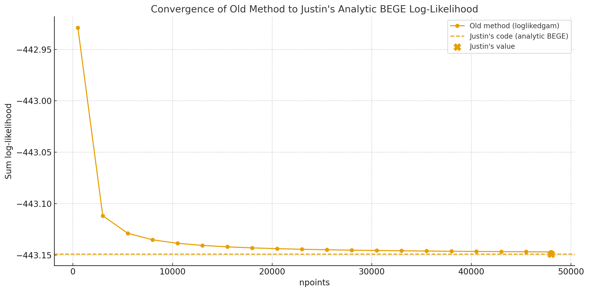

```{raw:typst}
#set page(margin: auto)
```

(gjr)=
# Inflation Dynamics


<!-- +++ {"part": "abstract"}
This is my abstract!
+++ -->

## I. Mean Processes

Four types of mean processes are of interest:

- **Constant**: $\pi_{t+1} = fc_t + \mu_{t+1}$
- **ARX(1,1)**: $\pi_{t+1} = c + \rho_1 \pi_t + \phi_1 fc_t + \mu_{t+1}$
- **ARX(2,1)**: $\pi_{t+1} = c + \rho_1 \pi_t + \rho_2 \pi_{t-1} + \phi_1 fc_t + \mu_{t+1}$
- **ARX(2,2)**: $\pi_{t+1} = c + \rho_1 \pi_t + \rho_2 \pi_{t-1} + \phi_1 fc_t + \phi_2 fc_{t-1} + \mu_{t+1}$

where $\mu_{t+1}$ is the residual term.

### I.a. OLS Results

I report OLS estimation results of three mean models[^1]:

[^1]: Standard errors are heteroskedasticity and autocorrelation robust (HAC) using 12 lags and without small sample correction.

**ARX(1,1)**:

$$
\begin{aligned}
\hat{\pi}_{t+1}
&= 0.0720 + 0.2881\,\pi_t + 0.7508\,fc_t \\
&= ~~(0.087) \quad (0.114) ~~~\quad (0.168)
\end{aligned}
$$

**ARX(2,1)**:

$$
\begin{aligned}
\hat{\pi}_{t+1}
&= 0.0792 + 0.2793\,\pi_t + 0.0728\,\pi_{t-1} + 0.6661\,fc_t \\
&= (0.087) ~~ \quad (0.102) ~~~ \quad (0.127) \quad ~~~~~~~~ (0.257)
\end{aligned}
$$

**ARX(2,2)**:

$$
\begin{aligned}
\hat{\pi}_{t+1}
&= 0.0761 + 0.2880\,\pi_t + 0.0799\,\pi_{t-1}
   + 0.4720\,fc_t + 0.1793\,fc_{t-1} \\
&= ~ (0.088) ~~\quad (0.109) ~~~\quad (0.127)
~~~~~~~~   \quad (0.440) \quad ~~~~~~~(0.295)
\end{aligned}
$$

To start the random search of initial mean parameters, I draw uniform samples from $(\mu - 2\sigma,\ \mu + 2\sigma)$ where $\mu$ and $\sigma$ are mean and standard deviation from OLS regression. I also set the AR coefficient bound to avoid the AR process to explode. We have four types of mean processes.

**Table 1: Parameter Bounds for Mean Process Specifications**

| Model     | $c$                         | $\rho_1$            | $\rho_2$            | $\phi_1$       | $\phi_2$       |
|-----------|-----------------------------|---------------------|---------------------|----------------|----------------|
| Constant  | ---                         | ---                 | ---                 | ---            | ---            |
| ARX(1,1)  | $(\min \pi_t,\ \max \pi_t)$ | $(-0.999,\ 0.999)$  | ---                 | $(-10,\ 10)$   | ---            |
| ARX(2,1)  | $(\min \pi_t,\ \max \pi_t)$ | $(-1.999,\ 1.999)$  | $(-0.999,\ 0.999)$  | $(-10,\ 10)$   | ---            |
| ARX(2,2)  | $(\min \pi_t,\ \max \pi_t)$ | $(-1.999,\ 1.999)$  | $(-0.999,\ 0.999)$  | $(-10,\ 10)$   | $(-10,\ 10)$   |

## II. GARCH Model Summarization

**Table 2: Model selection by AIC: GJR vs EGARCH**

| Distribution   | GJR Mean | GJR Vol | GJR AIC                          | EGARCH Mean | EGARCH Vol | EGARCH AIC |
|----------------|----------|---------|----------------------------------|-------------|------------|------------|
| Normal         | (1,1)    | (2,1)   | 359.4710                         | (1,1)       | (1,1)      | 368.2429   |
| $t$            | (1,1)    | (2,1)   | <span style="color:red">343.1431</span> | (2,1)       | (1,1)      | 344.6254   |
| Skew $t$       | (1,1)    | (2,1)   | 345.1312                         | (2,1)       | (1,1)      | 346.5791   |
| GED            | (1,1)    | (2,1)   | 345.1925                         | (1,1)       | (1,1)      | 347.6934   |
| Mix of Normal  | (1,1)    | (2,1)   | 345.8222                         | (2,1)       | (2,1)      | 343.5023   |

**Table 3: Model selection by BIC: GJR vs EGARCH**

| Distribution   | GJR Mean | GJR Vol | GJR BIC  | EGARCH Mean | EGARCH Vol | EGARCH BIC                       |
|----------------|----------|---------|----------|-------------|------------|----------------------------------|
| Normal         | FC       | (2,1)   | 381.4280 | FC          | (1,1)      | 383.4754                         |
| $t$            | FC       | (1,1)   | 367.8350 | FC          | (1,1)      | <span style="color:red">367.1732</span> |
| Skew $t$       | FC       | (1,1)   | 370.4242 | FC          | (1,1)      | 369.6649                         |
| GED            | FC       | (1,1)   | 371.8489 | FC          | (1,1)      | 370.9644                         |
| Mix of Normal  | FC       | (1,1)   | 373.7106 | FC          | (1,1)      | 371.0689                         |

## III. BEGE Density

BEGE density function $f_{BEGE}(\mu \mid p, n, \sigma_p, \sigma_n)$ is the function that calculates the density of the observation $\mu$ given the parameters $\{p, n, \sigma_p, \sigma_n\}$.

To compare Justin's analytic BEGE density code with the old numerical one, I conducted an experiment using synthetic data. I generated $200$ independent observations from a standard normal distribution and fixed the BEGE parameters to

$$
p = 5, \qquad n = 7, \qquad \sigma_p = 0.8, \qquad \sigma_n = 1.2.
$$

I computed the sum of log-likelihood using two approaches:

1. The *old BEGE function*, which approximates the density via numerical integration on a uniform grid, and whose accuracy depends strongly on the number of grid points; and
2. *Justin's analytic BEGE function*.

The old numerical method was evaluated over a wide range of grid resolutions (up to $50{,}000$ points), and the resulting log-likelihood sums were plotted alongside the benchmark value computed from Justin's code.



**Findings:**

- The old numerical likelihood converges toward Justin's analytic likelihood as the number of grid points increases, but the convergence is slow and requires very fine grids.
- For small or moderate grid sizes, the numerical integration *overestimates* the log-likelihood. This explains why, for a given set of parameters, Justin's implementation produces a lower log-likelihood than the old code.
- Justin's analytic BEGE formula provides a more accurate and more computationally efficient evaluation.

## IV. BEGE GARCH Family

### IV.a. Constant BEGE

The first model that I estimated is BEGE with invariant shape parameters, which is

$$
\begin{aligned}
\pi_{t+1} &= \hat{\pi}_{t+1} + u_{t+1}\\
u_{t+1} &= \sigma_p \omega_{p} - \sigma_n \omega_{n}
\end{aligned}
$$

where

$$
\omega_{p} \sim \tilde{\Gamma}(\bar{p}, 1), \quad \omega_{n} \sim \tilde{\Gamma}(\bar{n}, 1).
$$

$\bar{p}$ and $\bar{n}$ are unconditional shape parameters. The random search and bounds are set to be:

- $0.05 < \sigma_p, \sigma_n < 2$
- $0.1 < p, n < 10$

### IV.b. Symmetric BEGE

The model assumes different scaled parameters and different constants in GJR recursions for both components:

$$
\begin{aligned}
\pi_{t+1} &= \hat{\pi}_{t+1} + u_{t+1}, \\
u_{t+1} &= \sigma_p \, \omega_{p} - \sigma_n \, \omega_{n},
\end{aligned}
$$

where

$$
\omega_{p} \sim \tilde{\Gamma}(p_t, 1), \quad \omega_{n} \sim \tilde{\Gamma}(n_t, 1).
$$

Here $n_t, p_t$ is generated recursively through a GJR-type updating equation with parameters $(p_0, n_0, \rho, \phi^+, \phi^-)$:

$$
\begin{aligned}
p_{t} &= p_0 + \rho \, p_{t-1}
        + \frac{\phi^+ }{2  \sigma_p^2}\, (u_{t-1}^+)^2 + \frac{\phi^- }{2  \sigma_p^2}\,(u_{t-1}^-)^2,\\
n_{t} &= n_0 + \rho \, n_{t-1}
        + \frac{\phi^+ }{2  \sigma_n^2}\, (u_{t-1}^+)^2 + \frac{\phi^- }{2  \sigma_n^2} \,(u_{t-1}^-)^2
\end{aligned}
$$

The parameter bounds are chosen to be:

- $0.005 < p_0, n_0 < 10$,
- $10^{-5} < \rho < 0.999$,
- $10^{-5} < \phi^+, \phi^- < 0.999$,
- $10^{-5} < \sigma_p, \sigma_n < 2$.

### IV.c. Bad and Good Symmetric GARCH Model

Here $n_t, p_t$ is generated recursively with parameters $(p_0, n_0, \rho_p, \rho_n, \phi_p, \phi_n)$:

$$
\begin{aligned}
p_{t} &= p_0 + \rho_p \, p_{t-1}
        + \frac{\phi_p }{2  \sigma_p^2}\, (u_{t-1} )^2,\\
n_{t} &= n_0 + \rho_n \, n_{t-1}
        + \frac{\phi_n }{2  \sigma_n^2}\, (u_{t-1} )^2
\end{aligned}
$$

I have set the constraints below.

- $\rho + \phi < 1$ for both good and bad shape processes.
- $\sigma_p^2 p_0 + \sigma_n^2 n_0 < \mathrm{Var}(\pi_t)$.
- $\max\{p_t, n_t\} < 200$

### IV.d. Inflation and Deflation Model

Here $n_t, p_t$ is generated recursively with parameters $(p_0, n_0, \rho_p, \rho_n, \phi^+_p, \phi_n^-)$:

$$
\begin{aligned}
p_{t} &= p_0 + \rho_p \, p_{t-1}
        + \frac{\phi^+_p }{2  \sigma_p^2}\, (u_{t-1}^+)^2,\\
n_{t} &= n_0 + \rho_n \, n_{t-1}
      + \frac{\phi^- _n}{2  \sigma_n^2} \,(u_{t-1}^-)^2
\end{aligned}
$$

According to the emails, I have set the constraints below.

- $\rho_p + \frac{\phi_p^+}{2} < 1$ and $\rho_n + \frac{\phi_n^-}{2} < 1$.
- $\sigma_p^2 p_0 + \sigma_n^2 n_0 < \mathrm{Var}(\pi_t)$.
- $\max\{p_t, n_t\} < 200$

### IV.e. Full BEGE

BEGE GARCH has mean process and higher:

$$
\begin{aligned}
\pi_{t+1} &= \hat{\pi}_{t+1} + u_{t+1}, \\
u_{t+1} &= \sigma_p \, \omega_{p} - \sigma_n \, \omega_{n},
\end{aligned}
$$

where

$$
\omega_{p} \sim \tilde{\Gamma}(p_t, 1), \quad \omega_{n} \sim \tilde{\Gamma}(n_t, 1).
$$

Here $n_t, p_t$ is generated recursively through a GJR-type updating equation with parameters $(p_0, n_0, \rho_p, \rho_n, \phi^+_p, \phi_p^-, \phi_n^+, \phi_n^-)$:

$$
\begin{aligned}
p_{t} &= p_0 + \rho_p \, p_{t-1}
        + \frac{\phi^+_p }{2  \sigma_p^2}\, (u_{t-1}^+)^2 + \frac{\phi^-_p }{2  \sigma_p^2}\,(u_{t-1}^-)^2,\\
n_{t} &= n_0 + \rho_n \, n_{t-1}
        + \frac{\phi^+_n }{2  \sigma_n^2}\, (u_{t-1}^+)^2 + \frac{\phi^- _n}{2  \sigma_n^2} \,(u_{t-1}^-)^2
\end{aligned}
$$

The parameter bounds are chosen to be:

- $0.005 < p_0, n_0 < 10$,
- $10^{-5} < \rho_p, \rho_n < 0.999$,
- $10^{-5} < \phi^+_p, \phi_p^-, \phi_n^+, \phi_n^- < 0.999$,
- $10^{-5} < \sigma_p, \sigma_n < 2$.

According to the emails, I have set the constraints below.

- $\rho + \frac{\phi^+}{2} + \frac{\phi^-}{2} < 1$ for both BE and GE shape processes.
- $\sigma_p^2 p_0 + \sigma_n^2 n_0 < \mathrm{Var}(\pi_t)$ where $\mathrm{Var}(\pi_t) = 0.75$ is the unconditional variance of inflation.
- $\max\{p_t, n_t\} < 200$.

## V. Result Summary

Overall, most of the estimations with random initial values converge. I randomly sampled $100{,}000$ starting values for the constant BEGE model, and sampled $10{,}000$ for symmetric BEGE because it is more time consuming. I report the best estimation below.