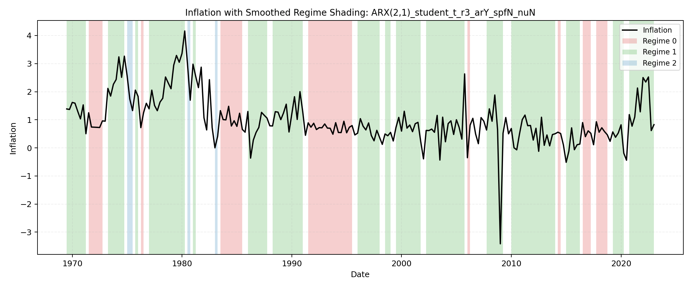

```{raw:typst}
#set page(margin: auto)
```

# Best Regime-Switching Model

Selected by AIC among estimates that passed optimizer convergence, stationarity, parameter-bound, distribution, and transition checks.

## Model Summary
| Mean process | Regime-switching parts | Non-switching parts | LogLik | AIC | BIC |
| --- | --- | --- | --- | --- | --- |
| ARX(2,1) | AR block, including $c$, $\sigma^2$ | SPF block, $\nu$ | -147.8112 | 335.6223 | 403.0351 |

## Switching Blocks
| Block | Switching |
| --- | --- |
| AR block, including $c$ | Y |
| SPF block | N |
| $\sigma^2$ | Y |
| $\nu$ | N |

## Mean Process
$$
\pi_{t+1} = c_{s_t} + \rho_{1,s_t}\,\pi_t + \rho_{2,s_t}\,\pi_{t-1} + \phi_1\,SPF_t + u_{t+1}
$$

## Mean Parameter Values
| Parameter | Switching | Regime 0 | Regime 1 | Regime 2 |
| --- | --- | --- | --- | --- |
| $c$ | Y | 0.4924 | -0.0159 | -0.3075 |
| $\rho_1$ | Y | -0.4103 | 0.1240 | 0.8039 |
| $\rho_2$ | Y | -0.1518 | 0.3155 | -0.5983 |
| $\phi_1$ | N | 0.8977 | 0.8977 | 0.8977 |

## Distribution Parameters
| Parameter | Switching | Regime 0 | Regime 1 | Regime 2 |
| --- | --- | --- | --- | --- |
| $\sigma^2$ | Y | 0.0282 | 0.3598 | 0.0174 |
| $\nu$ | N | 4.2263 | 4.2263 | 4.2263 |

## Transition Probability Matrix
| From \ To | Regime 0 | Regime 1 | Regime 2 | Row Sum |
| --- | --- | --- | --- | --- |
| Regime 0 | 0.7435 | 0.0003 | 0.2562 | 1.0000 |
| Regime 1 | 0.0648 | 0.8529 | 0.0823 | 1.0000 |
| Regime 2 | 0.1517 | 0.6759 | 0.1724 | 1.0000 |

## Regime Classification Plot
