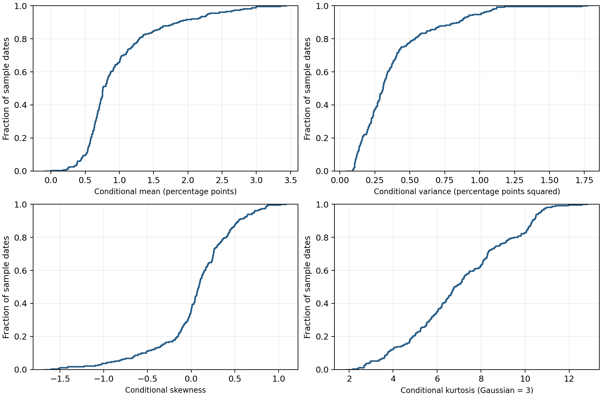

```{raw:typst}
#set page(margin: auto)
```

# Best Regime-Switching Model

Selected by AIC among the eligible estimates. The model has $K=3$ regimes, labeled by increasing innovation variance.

Final-solution stability: verified.

Effective sample: 1969Q2–2026Q3 (230 observations).

## Model Summary
| Mean process | Regime-switching parts | Non-switching parts | LogLik | AIC | BIC |
| --- | --- | --- | --- | --- | --- |
| ARX(1,1) | AR block, including $c$, $\sigma^2$ | SPF block | -167.3355 | 366.6710 | 421.6803 |

## Unconditional and Sample-Averaged Moments

The first two rows average the fitted predictive distributions uniformly over the observed sample. They are not stationary long-run moments of inflation: the model does not specify the joint stationary law of inflation lags and SPF. The third row is the stationary distribution of the regime shock $\varepsilon_{t+1}=\sigma_iz_{t+1}$, weighted by $\bar Q$. When means switch, this shock differs from the forecast residual $u_{t+1}=\pi_{t+1}-\hat{\pi}_{t+1}$.

| Distribution | Mean | Variance | Skewness | Kurtosis |
| --- | --- | --- | --- | --- |
| Inflation: sample-averaged predictive mixture | 0.9866 | 0.7319 | 0.8554 | 5.0230 |
| Residual: sample-averaged predictive mixture | 0.0000 | 0.3802 | -0.0998 | 6.6273 |
| Regime shock: stationary mixture | 0.0000 | 0.3257 | 0.0000 | 7.7759 |

Mean is measured in percentage points per period and variance in squared percentage points. Skewness and kurtosis are dimensionless. Kurtosis is Pearson kurtosis (Gaussian = 3); excess kurtosis is this value minus 3.

## Empirical Distributions of Conditional Moments

Each observation contributes one value of the predictive mean, variance, skewness, and kurtosis, calculated using $Q_t$ before observing inflation. The table and empirical CDFs describe variation over dates, not sampling uncertainty about parameters. The formulas are given in the regime-switching methodology section.

| Conditional moment | Average | 5% | 25% | Median | 75% | 95% |
| --- | --- | --- | --- | --- | --- | --- |
| mean | 0.9866 | 0.3840 | 0.6263 | 0.7566 | 1.1760 | 2.2842 |
| variance | 0.3802 | 0.1080 | 0.1980 | 0.3078 | 0.4380 | 0.9827 |
| skewness | 0.0477 | -0.8518 | -0.1080 | 0.0841 | 0.2935 | 0.7074 |
| kurtosis | 7.0267 | 3.1410 | 5.2621 | 6.8000 | 8.7739 | 10.6418 |

The regime means differ, so the predictive distribution can be skewed even though each regime is Gaussian. Its variance includes uncertainty about the regime mean.

The average conditional skewness or kurtosis generally differs from the skewness or kurtosis of the sample-averaged distribution above.



## Switching Blocks
| Block | Switching |
| --- | --- |
| AR block, including $c$ | Y |
| SPF block | N |
| Shock distribution ($\sigma^2$) | Y |

## Mean Process
$$
\pi_{t+1} = c_i + \rho_{1,i}\,\pi_t + \phi_1\,SPF_t + \sigma_i z_{t+1},\qquad Z_t=e_i.
$$

Here $Z_t=e_i$ denotes regime $i$, which generates $\pi_{t+1}$, and $z_{t+1}$ is the standardized innovation with the distribution reported below.

## Mean Parameter Values
| Parameter | Switching | Regime 0 | Regime 1 | Regime 2 |
| --- | --- | --- | --- | --- |
| $c$ | Y | 0.4496 | -0.0795 | 0.1578 |
| $\rho_1$ | Y | -0.3794 | 0.5227 | 0.1875 |
| $\phi_1$ | N | 0.7821 | 0.7821 | 0.7821 |

## Distribution Parameters
| Parameter | Switching | Regime 0 | Regime 1 | Regime 2 |
| --- | --- | --- | --- | --- |
| $\sigma$ | Y | 0.2067 | 0.3996 | 1.0549 |

## Sample Mean Inflation by Regime
| Regime | Assigned dates | Sample mean of $\pi$ |
| --- | --- | --- |
| 0 | 72 | 0.7333 |
| 1 | 118 | 0.9766 |
| 2 | 40 | 1.4253 |

**Note.** Each observation $\pi_{t+1}$ is assigned to the regime $i=\arg\max_j\widetilde{Q}_{j,t}$, using the same smoothed classification as the plot. The table reports the simple, unweighted average of observed inflation over the dates assigned to each regime, in percent per quarter or month, without annualization. These sample means illustrate average inflation within each classified regime; they are not model-implied unconditional means.

## Transition Probability Matrix
| From \ To | Regime 0 | Regime 1 | Regime 2 | Row Sum |
| --- | --- | --- | --- | --- |
| Regime 0 | 0.8154 | 0.1846 | 0.0000 | 1.0000 |
| Regime 1 | 0.0415 | 0.8617 | 0.0968 | 1.0000 |
| Regime 2 | 0.1716 | 0.0495 | 0.7789 | 1.0000 |

## Regime Classification Plot
Shading selects the largest component of $\widetilde{Q}_t=E[Z_t\mid\mathcal{F}_T]$ and displays it at the date of $\pi_{t+1}$. It uses the full sample.


